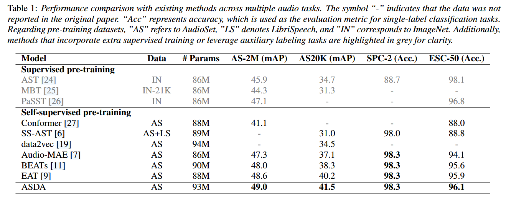

# [INTERSPEECH 2025] ASDA: Audio Spectrogram Differential Attention Mechanism for Self-Supervised Representation Learning


🔗 **[Paper](https://arxiv.org/pdf/2507.02666)**

## Overview 
 - ASDA (Audio Spectrogram Differential Attention) addresses the limitation of standard Transformer architectures in audio processing, where attention weights are often allocated to irrelevant information. The key innovation is a differential attention mechanism that integrates dual-softmax operations and tuned differential coefficients to mitigate ineffective attention allocation.
- Achieves 49.0% mAP on AS-2M, 41.5% mAP on AS20K, 98.3% accuracy on SPC-2, and 96.1% accuracy on ESC-50.

## Results
Performance comparison with existing methods across multiple audio tasks.   


---
## Model Checkpoints

| Model Type               | Link                                                                                       |
|--------------------------|--------------------------------------------------------------------------------------------|
| **Pre-Trained**          | [Download]() |
| **AS2M Fine-Tuned**      | [Download]() |
---

## Inference Mode
If you are already using [EAT](https://github.com/cwx-worst-one/EAT) in your evaluation/inference pipeline, you can simply replace the weights with ASDA weights, as the inference and evaluation code is identical to EAT.
If not, follow the steps below for installation:

## Requirements
Python >= 3.8 and pip < 24.1.
```bash
git clone https://github.com/pytorch/fairseq
cd fairseq
pip install --editable ./
git clone https://github.com/MyParadise21/ASDA
pip install -r requirements.txt
```

## Audio Feature (Representation) Extraction
```bash
bash feature_extract.sh 
```

## Inference and Evaluation
To inference on single wav file, use:
```bash
bash inference.sh
```

To evaluate on the full AudioSet evaluation set, use:
```bash
bash eval.sh 
```

## Data Preparation
We utilized [AudioSet-2M](https://research.google.com/audioset/) for pre-training. At this stage, only the `tsv` file is required. Refer to [train.tsv for AudioSet-20K](data_manifest/manifest_as20k/train.tsv) to prepare the corresponding `train.tsv` file required for AudioSet-2M.

## Pre-Training 
```bash
bash pretraining_AS2M.sh 
``` 

## Fine-Tuning
We have provided fine-tuning scripts for different datasets. For example, you can fine-tune ASDA on `AS20K` by executing: 
```bash
bash finetuning_AS20K.sh
```

## Acknowledgements

Our codes are based on [EAT](https://github.com/cwx-worst-one/EAT/tree/main) and [data2vec 2.0](https://github.com/facebookresearch/fairseq/tree/main/examples/data2vec) with additional concepts and components adapted from [AudioMAE](https://github.com/facebookresearch/AudioMAE).


## 📜Citation

If you find our work useful, please cite it as:  

```bibtex
@article{ASDA,
  title={ASDA: Audio Spectrogram Differential Attention Mechanism for Self-Supervised Representation Learning},
  author={Junyu Wang and Tianrui Wang and Meng Ge and Longbiao Wang and Jianwu Dang},
  journal={arXiv:2507.02666},
  year={2025},
}
